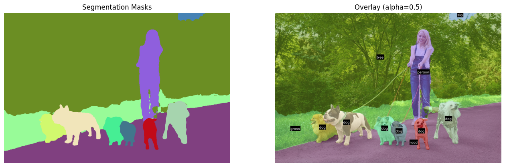

    <h1>Panoptic Segmentation using DETR   in Hugging Face </h1>

  

---

## 🏗️ Methodology

- 🎨🖌️ Panoptic Segmentation Model1: **facebook/detr-resnet-50-panoptic**
- 🎨🖌️ Panoptic Segmentation Model2: **facebook/detr-resnet-101-panoptic**
- 🎨🖌️ App: **COCO categories**
- 🎨🖌️ Framework: **PyTorch + Hugging Face**

---

## ⭐ Acknowledgements

- DETR powered by `Hugging Face`

---
